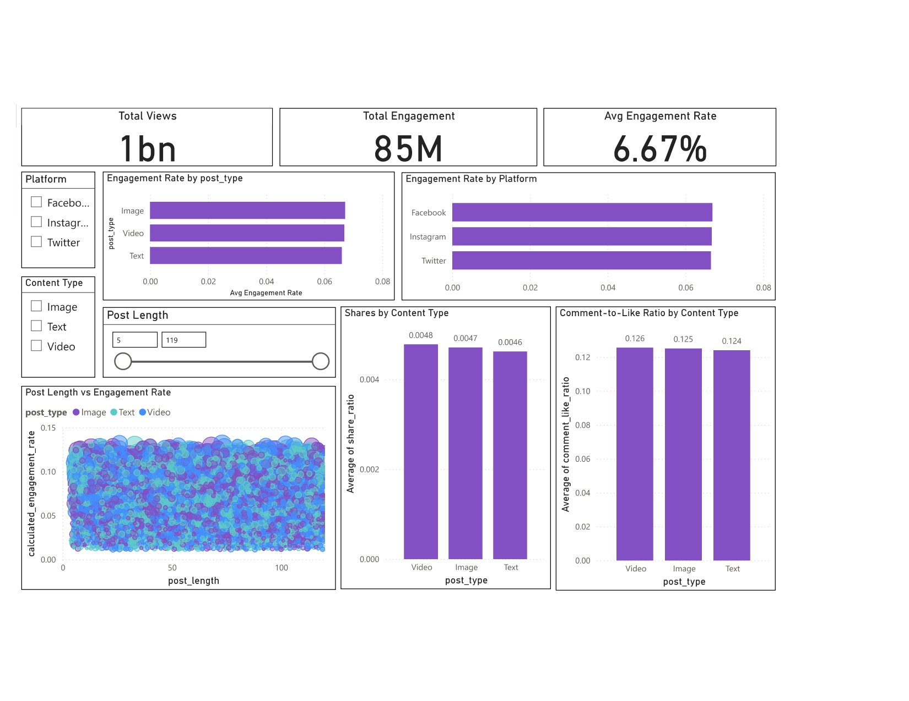

# Social Media Analytics Dashboard 📊

## Project Overview
This project analyzes social media post engagement to help optimize content creation strategy using data analytics and visualization.

## Objective
- Identify high-performing platforms and content types
- Analyze engagement trends across post formats
- Provide actionable insights for content strategy

## Tools Used
- Power BI
- Power Query
- DAX
- GitHub

## Key Metrics
- Total Views
- Total Engagement
- Engagement Rate
- Share Ratio
- Comment-to-Like Ratio

## Visualizations
- Engagement Rate by Platform
- Engagement Rate by Content Type
- Post Length vs Engagement Rate (Scatter Plot)
- Shares by Content Type
- Comment-to-Like Ratio by Content Type

## Dashboard Preview

## Dataset
Source: Kaggle – Social Media Post Engagement Dataset

## Key Insights
- Video content drives the highest engagement rate
- Medium-length posts show stronger engagement
- Instagram outperforms other platforms in engagement

## Author
Mayuri
